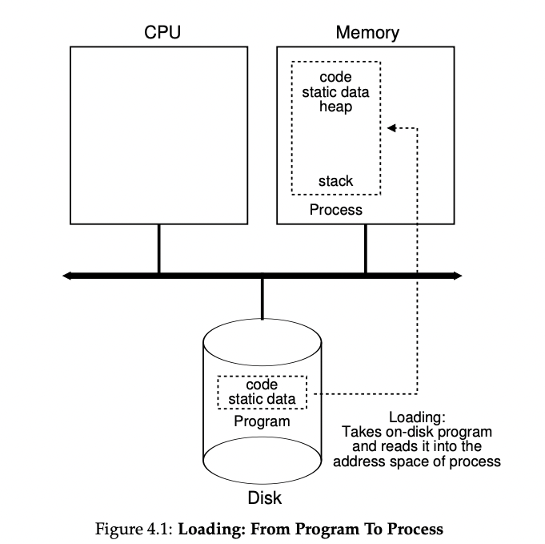
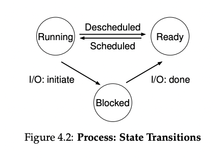
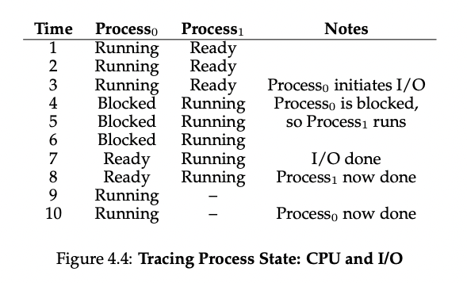

# Operating Systems in 3 Easy Pieces (virtualization, concurrency, persistence)

## Chapter 2: Introduction to Operating Systems

### What happens when a program runs?

A running program does one simple thing: it executes instructions. Many millions/billion of times a second, the processor `fetches` an instruction from memory, `decodes` it (i.e. figures out what instruction it is), and `executes` it. Afterwards, it moves to the next instruction. 

The body of software, the operating system, is responsible for making it easy to run programs (seemingly many at the same time), allowing programs to share memory, enable programs to interact with devices, and make sure the system operates correctly and efficiently in an easy-to-use manner. The primary way the OS does this is through virtualization. 

```
How does the OS virtualize resources?

Why the OS does this is not the main question-- it makes the system easier to use. The main question is how: what mechanisms and policies are implemented by the OS? how does the OS do so efficiently? what hardware support is needed?
```

The OS takes a `physical resource` (such as
the processor, or memory, or a disk) and transforms it into a more general, powerful, and easy-to-use `virtual` form of itself. Thus, we sometimes refer to the operating system as a `virtual machine`.

In order to allow users to tell the OS what to do and make use of the VM (such as running programs, allocating memory, or accessing a file) the OS provides APIs, `system calls`, that are available to applications. 

Virtualization allows many programs to run concurrently access their own instructions and data while sharing the CPU and memory. The OS is sometimes known as a `resource manager`.  Each of the CPU, memory, and disk is a `resource` of the system and it's OS’s role to `manage` those resources.

The OS with some help from the hardware is in charge of `illusion` (the illusion that the system has a very large number of virtual CPUs). Turning a single CPU (or a small set of them) into a seemingly infinite number of CPUs and thus allowing many programs to seemingly run at once is what we call `virtualizing the CPU`.

The question of which program should run if two programs want to run at the same time is determined by a `policy` of the OS. 

The model of `physical memory` is just an array of bytes. To `read` memory, one must specify an `address` to be able to access the data stored there. To `write` or `update` memory, one must also specify the data to be written to the given address. 


```c
#include <unistd.h>
#include <stdio.h>
#include <stdlib.h>
#include "common.h"

int main(int argc, char *argv[])
{
    int *p = malloc(sizeof(int)); // a1
    assert(p != NULL);
    printf("(%d) address pointed to by p: %p\n",
    getpid(), p); // a2
    *p = 0; // a3
    while (1) {
    Spin(1);
    *p = *p + 1;
    printf("(%d) p: %d\n", getpid(), *p); // a4
    }
    return 0;
}
```
Figure 2.3: A Program That Accesses Memory (mem.c)

At line a1 the program allocates some memory using malloc(). a2 prints out the address of the memory. next it puts the number 0 into the first slot of the newly allocated memory (a3). Finally we loop delaying for a second and incrementing the value stored at the address held in p. 

With every print statement (a4) it prints the proccess identifier (the PID) of the running program. The first result isn't too interesting the newly allocated memory is at address `0x200000`.

If we run multiple instances however, each program has allocated memory at the same address `0x200000`, but each instance seems to be updating the value at the same address independently. It gives the illusion that each running program has its own private memory, instead of sharing the same physical memory with other running programs. 

This process is known as `virtualizing memory`: each process accesses its own `virtual address space` (sometimes just called its `address space`), which the OS somehow maps onto the physical memory of the machine. As far as the program as concerned, it has physical memory all to itself. 

### 2.3 Concurrency 

The problems of concurrency juggling many things at once arose within the first operating system itself. Modern `multi-threaded` programs exhibit the same problems. 

```c
#include <stdio.h>
#include <stdlib.h>
#include "common.h"
#include "common_threads.h"

volatile int counter = 0;
int loops;

void *worker(void *arg) {
    int i;
    for (i = 0; i < loops; i++) {
        counter++;
    }
    return NULL;
}

int main(int argc, char *argv[]) {
    if (argc != 2) {
        fprintf(stderr, "usage: threads <value>\n");
        exit(1);
    }
    loops = atoi(argv[1]);
    pthread_t p1, p2;
    printf("Initial value : %d\n", counter);

    Pthread_create(&p1, NULL, worker, NULL);
    Pthread_create(&p2, NULL, worker, NULL);
    Pthread_join(p1, NULL);
    Pthread_join(p2, NULL);
    printf("Final value : %d\n", counter);
    return 0;
}
```
Figure 2.5: A Multi-threaded Program (threads.c)

The main program creates two `threads` using `Pthread_create()`. A thread is like a function running within the same memory space as other functions, with more than one of them active at a time. In this example, each thread starts running in a routine `worker()`, where it simply increments a counter in a loop. 

For lower values, the program works as intended. But for higher values, we may get the correct value or different but wrong values. The reason for these outcomes is due to how the instructions are executed (one at a time). 

The shared counter that is incremented, takes three instructions: one to load the value of the counter from memory into a register, one to increment it, and one to store it back into memory. Because these three instructions do not execute `atomically` (all at
once), strange things can happen. This is a problem of `concurrency`.

```
How can we build concurrent problems? When there are many concurrently executing threads within the same memory space, how can we build a correctly working program?
```

### 2.4 Persistence

In system memory, data can be easily lost, as devices such as DRAM store values in a `volatile` manner; when power goes away or system crashes any data in memory is lost. Therefore we need hardware and software to store data `persistently`. 

The hardware comes in the form of a `input/output` or `I/O` device. A `hard drive` / `solid state drive` `(SSD)` are common repositories for long-lived information. 

The software in the OS that manages the disk is the `file system` and is responsible for storing `files` the user creates in a reliable and efficient manner. 

Unlike the CPU and Memory, the OS does not create a virtualized disk for each application. It is assumed that users will want to `share` information that is in files. 

### 2.5 Design Goals

Now we know an OS takes physical `resources`, such as a CPU, memory, or disk, and `virtualizes` them. It handles tough and tricky issues related to concurrency. And it stores files `persistently,` thus making them safe over the long term. In order to build our system we need to build up some `abstractions` to make the system convenient and easy to use. Abstractions makes it possible to write a large program by dividing it into small and understandable pieces. 

## Chapter 4: The Abstraction: The Process

One of the most fundamental abstractions that the OS provides to users is the `process`: a `running program` that just kind of sits on the disk with a bunch of instructions (and maybe some static data) waiting to spring into action. It is the OS that takes these bytes and gets them running, transforming the program into something useful. 

```
How to provide the illusion of many CPUs? Although there are only a few physical CPUs available, how can the OS provide the illusion of a nearly-endless supply of said CPUs?
```

The OS creates this illusion by `virtualizing` the CPU. By running one process, stopping it, and running another, etc. giving the illusion of many virtual CPUs, is a basic technique known as `time sharing` of the CPU. This allows users to run as many concurrent processes as they like. The potential cost is performance as each process will run slower since the CPU is shared. 

To implement this, we need low-level machinery known as `mechanisms` (low-level methods or protocols that implement a needed piece of functionality) and some high-level intelligence. One `time-sharing` mechanism is a `context switch` which gives the OS the ability to stop running one program and start running another on a given CPU. 

On top of these mechanisms is the high-level intelligence in the form of `policies` (algorithms for making some kind of decision in the OS). For example, a `scheduling policy` will make the decision of which program to run on a CPU when there are many options at a given time (likely using historical info: which program has run more in the last minute? workload info: what types of programs are run? and performance metrics: is the system optimizing for interactive performance or thoughtput? to make its decision).

### 4.1 The Abstraction: A process

The abstraction of a running program is a `process`. We can summarize a process by taking an inventory of the different pieces of the system it accesses or affects during the course of its execution. 

The `machine state` is what a program can read or update when it's running. One component of the machine state within a process is its `memory`. Instructions and the data that the running program reads and writes lie in memory. The memory that the process can address (its `address space`) is part of the process. Another part of the process's machine state are `registers`. Many instructions read/update registers and are important to the execution of the process. 

There are some particularly special registers that form part of the machine state. For example, the `program counter (PC)` tells us which instruction the program will execute next. Similarly, a `stack pointer` and associated `frame pointer` are used to manage the stack for function parameters, local variables, and return addresses. Finally, programs often access persistent storage devices too (i.e. I/O info for the list of files the process currently has open).

```
In many OS, a common design paradigm is to separate high-level policies from their low-level mechanisms. You can think of the mechanism as providing the answer to a `how` question about a system (`how` does an OS perform a context switch?) and the policy provides the answer to a `which` question (`which` process should the operating system run right now?). Separating the two allows one easily to change policies without having to rethink the mechanism and is a form of `modularity`.
```

### 4.2 Process API

Here is a general idea of what must be included in any interface of an OS. 

- **Create**: A method to create new processes. i.e. when you type a command into the shell, or double-click an application icon, the OS is invoked to create a new process to run the program indicated
- **Destroy**: interface to destroy processes forcefully. The user may wish to kill them, and interface to halt a runaway process is useful
- **Wait**: Sometimes useful to wait for a process to stop running; thus some kind of waiting interface
- **Miscellaneous Control**: i.e. some kind of method to suspend a process (stop from running for a while) then resume it.
- **Status**: Interface to get some status information about a process (i.e. how long has it run or what state it is in)

### 4.3 Process Creation: A little more detail

Steps to run a program:
1. OS must `load` its code and any static data (e.g., initialized variables) into memory, into the address space of the process.

Programs initially reside on `disk` (or in some modern systems, `flash-based SSDs`) in some kind of `executable format`. So the OS must read bytes from the disk to load a program and static data into memory. 

In early OS, the loading process is done `eagerly`, or all at once before running the program. Modern OSs perform the process `lazily`, or by loading pieces of code or data only as they are needed during program execution using machinery of `paging` and `swapping`. 

2. Once code and static data loaded into memory, OS needs to allocate some memory for the program's `run-time stack` (or just `stack`). 

C programs use the stack for local variables, function parameters, and return addresses, the OS allocates this memory and gives it to the process. The OS will likely initialize the stack with arguments (i.e. the main() function with `argc` and `argv` array).

3. The OS may allocate some memory for the program's `heap`. 

In C programs, the heap is used for explicitly requested dynamically-allocated data. Programs request such space by calling `malloc()` and free it by explicitly by calling `free()`. The heap is needed for data structures such as linked lists, hash tables, trees, etc. The heap will be small at first, but as the program runs and requests more memory, the OS may get involved and allocate more memory to the process to help satisfy such calls. 

4. Other initialization tasks, particularly related to input/output (I/O), the OS has finally set the stage for program execution.

5. Last step is to start the program running at the entry point, namely `main()`. By jumping to the `main()` routine the OS transfers control of the CPU to the newly-created process, and the program begins execution. 

### 4.4 Process States


In a simplified view, a process can be in one of three `states`:
- **Running**: In the running state, a process is running on a processor. This means it is executing instructions. 
- **Ready**: In the ready state, a process is ready to run but for some reason the OS has chosen not to run it at this given moment.
- **Blocked**: In the blocked state, a proces has performed some kind of operation that makes it not ready until some other event takes place. (common example: when a process initiates an I/O request to a disk it becomes blocked and thus some other process can use the processor)

As depicted on the diagram, a process can be moved between the ready and running states at the discretion of the OS. being moved from ready to running means the process has been `scheduled`, being moved from running to ready means the process has been `descheduled`. Once a process has been blocked, the OS will keep it as such until some event occurs (i.e. IO completion) where the process moves to the ready state again. 



In this example
1. Process_0 initiates an I/O after running for some time
2. Process is blocked, giving Process_1 a chance to run
3. While Process_1 is running the I/O completes moving Process_0 back to ready. 
4. Process_1 finishes, and process P_0 runs and finishes

This example highlights some of the many decisions the OS must make. First the system had to decide to run Process_1 while Process_0 issued an I/O; doing so improved resource utilization by keeping the CPU busy. Second, the system decided not to switch back to Process_0 when its I/O completed. These types of decisions are made by the OS `scheduler`. 

### Data Structures

```cpp
// the registers xv6 will save and restore
// to stop and subsequently restart a process
struct context {
    int eip;
    int esp;
    int ebx;
    int ecx;
    int edx;
    int esi;
    int edi;
    int ebp;
};

// the different states a process can be in
enum proc_state { UNUSED, EMBRYO, SLEEPING,
RUNNABLE, RUNNING, ZOMBIE };
// the information xv6 tracks about each process
// including its register context and state

struct proc {
    char *mem; // Start of process memory
    uint sz; // Size of process memory
    char *kstack; // Bottom of kernel stack
    // for this process
    enum proc_state state; // Process state
    int pid; // Process ID
    struct proc *parent; // Parent process
    void *chan; // If !zero, sleeping on chan
    int killed; // If !zero, has been killed
    struct file *ofile[NOFILE]; // Open files
    struct inode *cwd; // Current directory
    struct context context; // Switch here to run process
    struct trapframe *tf; // Trap frame for the
    // current interrupt
};
```
**Figure 4.5: The xv6 Proc Structure**

The OS is a program and it has some key data structures that track various pieces of information. To track the state of each process, the OS likely will keep some kind of `process list` for all processes that are ready and some additional info to track which process is currently running. The OS must also track blocked processes(when an I/O event completes, wake correct process, run it again).

The figure outlines some of the info the OS tracks about a process. The `register context` will hold, for a stopped process, the contents of its registers. When a process is stopped, its registers will be saved to this memory location; by restoring these registers (i.e. placing their values back into the actual physical registers), the OS can resume running the process. This is `context switching`. 

There are also a few more states a process can be in (beyong running, ready, and blocked). Sometimes a system will have an `initial` state that the process is in while being created, or a `final` state where it has exited but has not yet been cleaned up (in UNIX-based systems, this is called the `zombie` state). The final state can be useful as it allows other processes(mainly the parent that created the process) to examine and return code of the process and see if the just-finished process executed sucesfully (in unix based systems successful program execution == 0).  When finished, the parent will make one final call (i.e. wait()) to wait for the completition of the child, and indicate to the OS that it can clean up any relevant data structures that referred to the now extinct process

### 4.6 Summary
The most basic abstraction of the OS: the process. It is quite simply viewed as a running program. It is usually made up of low-level mechanisms needed to impl processes, and the higher-level policies required to schedule them in an intelligent way. Combining mechanisms and policies is one component to how an OS virtualizes the CPU

```
Key Process Terms:
```
- the `process` is a major OS abstraction of a running program. At any point in time, the process can be described by its state: the contents of memory in its `address space`, the contents of its CPU registers (including the `program counter` and `stack pointer`), and information about I/O (such as open files which can be read or written)
- The `process API` consists of calls programs can make related to processes. Typically, this includes creation, destruction, and other useful calls.
- Processes exist in one of many different `process states`, including running, ready, and blocked. Different events (e.g., getting scheduled or descheduled, or waiting for an I/O to complete) transition a process from one of these states to the other. 
- A `process list` contains information about all processes in the system. Each entry is found in what is sometimes called a `process control block (PCB)` which is really just a structure that contains information about a specific process. 