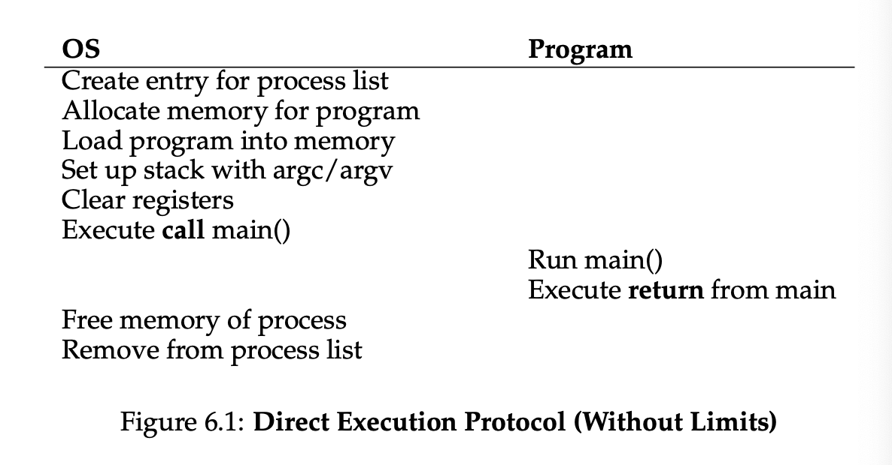
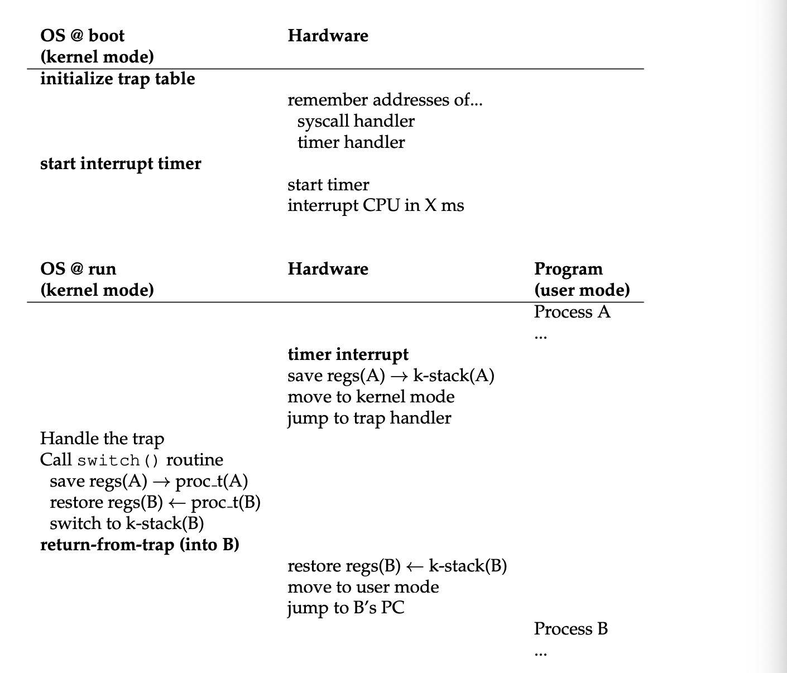
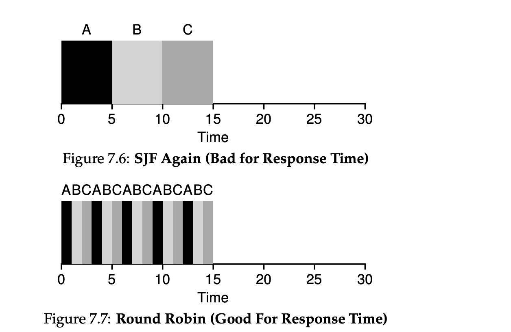
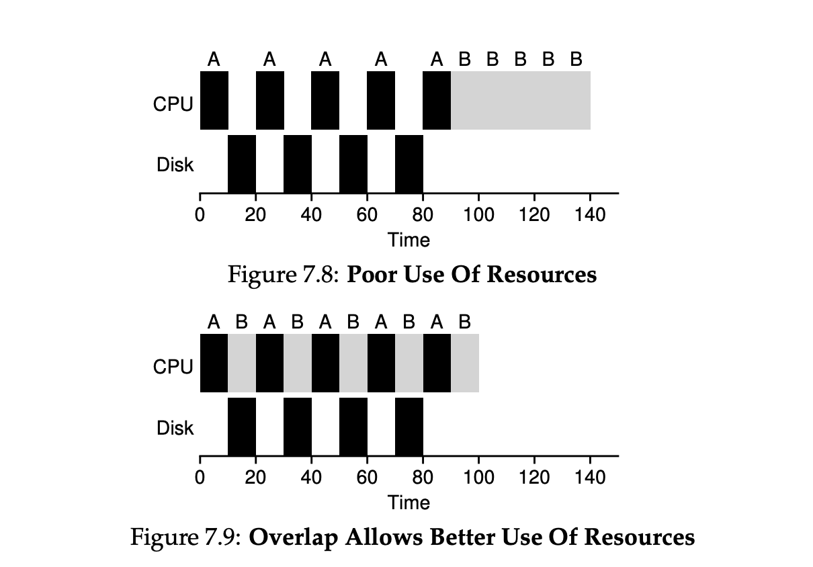

## Chapter 5: Interlude: Process API


### Process creation in UNIX systems

UNIX uses an interesting method to create a new process with a pair of system calls: `fork()` and `exec()`. A third routine, `wait()`, can be used by a process wishing to wait for a process it has created to complete.
```
How can we create and control processes. What interfaces should the OS present for process creation and control? How should these interfaces be designed to enable powerful functionality, ease of use, and high performance?
```

### 5.1 the `fork()` System call

The `fork()` system call is used to create a new process, but it is a bit strange.

```c
#include <stdio.h>
#include <stdlib.h>
#include <unistd.h>

int
main(int argc, char *argv[])
{
    printf("hello world (pid:%d)\n", (int) getpid());
    int rc = fork();
    if (rc < 0) {
        // fork failed; exit
        fprintf(stderr, "fork failed\n");
        exit(1);
    } else if (rc == 0) {
        // child (new process)
        printf("hello, I am child (pid:%d)\n", (int) getpid());
    } else {
        // parent goes down this path (original process)
        printf("hello, I am parent of %d (pid:%d)\n",
	       rc, (int) getpid());
    }
    return 0;
}
```
Figure 5.1: `Calling fork() (p1.c)`

When run:

```
prompt> ./p1
hello (pid:29146)
parent of 29147 (pid:29146)
child (pid:29147)
prompt>
```

When p1.c first started running, the process prints out a hello message with its `process identifier (PID)` of 29146. In UNIX systems, the PID is used to name the process if one wants to do something with the process, such as stop it from running. 

The process then calls the `fork()` system call, which the OS provides as a way to create a new process. The process that is created is an (almost) `exact copy of the calling process`. To the OS, it now looks like there are two copies of the program `p1` running, and both are about to return from the `fork()` system call. The newly-created process is called the `child` as it is copied from the current "calling process" known as the `parent`. The child doesn't start running at `main()` but comes into life as if it had called `fork()` itself.

The child is not an `exact` copy. Specifically, although it was a copy of the address space (i.e. its own private memory), its own registers, its own PC, etc., the value it returns to the caller of `fork()` is different. While the parent receives the PID of the newly-created child, the child receives a return code of 0. 

Note: put simply, child process is == 0, parent != 0, and value < 0, means fork failed

the output (of p1.c) is `not deterministic`. When the child process is created, there are now two active processes in the system (child and parent). Assuming we are on a single CPU system, then either the child or parent might run at that point. 

The CPU `scheduler` determines which process runs at a given moment in time, because this scheduler is complex we cannot usually make strong assumptions about what it will choose to do Either (the child or parent) process might run first, which is why this is non-deterministic as we cannot guarantee / determine the order in which things run. This `non-determinism` leads to interesting problems, esp in the context of `multi-threaded programs`. We will see a lot more of this with `concurrency`. 

### 5.2: The `wait()` System Call


```c
#include <stdio.h>
#include <stdlib.h>
#include <unistd.h>
#include <sys/wait.h>

int
main(int argc, char *argv[])
{
    printf("hello world (pid:%d)\n", (int) getpid());
    int rc = fork();
    if (rc < 0) {
        // fork failed; exit
        fprintf(stderr, "fork failed\n");
        exit(1);
    } else if (rc == 0) {
        // child (new process)
        printf("hello, I am child (pid:%d)\n", (int) getpid());
	sleep(1);
    } else {
        // parent goes down this path (original process)
        int wc = wait(NULL);
        printf("hello, I am parent of %d (wc:%d) (pid:%d)\n",
	       rc, wc, (int) getpid());
    }
    return 0;
}
```
Figure 5.2: `Calling fork() and wait() (p2.c)`

and output:

```
prompt> ./p2
hello (pid:29266)
child (pid:29267)
parent of 29267 (rc_wait:29267) (pid:29266)
prompt>
```
So far our program just creats a child that prints a message and exits. Sometimes it is quite useful for a parent to wait for a child process to finish what it has been doing. This is accomplished using `wait()` system call (or more complete sibling, waitpid()). in p2.c the parent process calls `wait()` to delay execution until the child finishes executing. When the child is done, `wait()` returns to the parent. Adding a `wait()` call to the code above makes the output deterministic. 

This is because we now know the child will always print first. If the child runs first as before, it will simply print before the parent. However, if the parent runs first, it will call `wait();` and the system call wont return until the child has run and exited. Therefore even when the parent runs first it still waits for the child to finish running. 

### 5.3: The `exec()` System Call

```c
#include <stdio.h>
#include <stdlib.h>
#include <unistd.h>
#include <string.h>
#include <sys/wait.h>

int
main(int argc, char *argv[])
{
    printf("hello world (pid:%d)\n", (int) getpid());
    int rc = fork();
    if (rc < 0) {
        // fork failed; exit
        fprintf(stderr, "fork failed\n");
        exit(1);
    } else if (rc == 0) {
        // child (new process)
        printf("hello, I am child (pid:%d)\n", (int) getpid());
        char *myargs[3];
        myargs[0] = strdup("wc");   // program: "wc" (word count)
        myargs[1] = strdup("p3.c"); // argument: file to count
        myargs[2] = NULL;           // marks end of array
        execvp(myargs[0], myargs);  // runs word count
        printf("this shouldn't print out");
    } else {
        // parent goes down this path (original process)
        int wc = wait(NULL);
        printf("hello, I am parent of %d (wc:%d) (pid:%d)\n",
	       rc, wc, (int) getpid());
    }
    return 0;
}
```
Figure 5.3: `Calling fork(), wait(), and exec() (p3.c)`

and output:

```
prompt> ./p3
hello (pid:29383)
child (pid:29384)
29 107 1030 p3.c
parent of 29384 (rc_wait:29384) (pid:29383)
prompt>
```

The final and important piece of process creation API is the `exec()` system call. This sys call is useful when you want to run a program that is different from the calling program. For example, calling `fork()` in p2.c is only useful if you want to keep running copies of the same program. However, if you want to run a `different` program, `exec()` does just that. 

In p3.c the child process calls `execvp()` in order to run the program `wc`, which is the word counting program on the source file `p3.c` which tells us how many lines, words, and bytes are found in that file. 

The `exec()` call takes the given name of an executable (i.e. wc), and some arguments (i.e. p3.c), it `loads` code (and static data) from that executable and overwrites its current code segment (and current static data) iwth it. The heap, stack, and other parts of memory get re-initialized. The OS then simply runs that program passing in any arguments as the `argv` of that process. 

To recap instead of creating a new process `exec()` transforms the currently running program (formerly p3) into a different running program (wc). After the `exec()` in the child, it is almost as if p3.c never ran. A succesfull call to `exec()` never returns. 

### 5.4: Why? Motivating The API

The separation of `fork()` and `exec()` is essential in building a UNIX shell, because it lets the shell code run `after` the call to `fork()` but `before` the call to `exec()`. This code can alter the environment of the about to be run program and enables a variety of features. 

The shell is just a user program, it shows you a `prompt` and waits for you to type a command [name of executable program + arguments]. In most cases the shell figures out where in the file system the executable resides, calls `fork()` to create a new child process to run the command, and then calls some variant of `exec()` to run the command, and waits for the command to complete by calling `wait()`. When the child completes, the shell returns from `wait()` and prints out a prompt again ready for the next command. 

This separation of `fork()` and `exec()` allow the shell to do a bunch of things i.e.

```bash
prompt> wc p3.c > newfile.txt
```

the output of the wc program is `redirected` into the output file `newfile.txt`. The shell creates a child and before calling `exec()`, the shell (specifically, the code executed in the child process) closes `standard output` and opens the file `newfile.txt`. By doing so, any output from the soon to be running program `wc` is sent to the file instead of the screen (open file descriptions are kept open access the `exec()` call). 

The reason this redirection works is due to an assumption about how the OS manages file descriptors. UNIX systems start looking for free file descriptors at zero, in this case, STDOUT_FILENO will be the first available one and thus gets assigned when `open()` is called. Subsequent writes by the child process to the standard output file descriptor (i.e. printf()) will be routed transparently to the newly-opened file instead of the screen. 

```c
#include <stdio.h>
#include <stdlib.h>
#include <unistd.h>
#include <string.h>
#include <fcntl.h>
#include <assert.h>
#include <sys/wait.h>

int
main(int argc, char *argv[])
{
    int rc = fork();
    if (rc < 0) {
        // fork failed; exit
        fprintf(stderr, "fork failed\n");
        exit(1);
    } else if (rc == 0) {
	// child: redirect standard output to a file
	close(STDOUT_FILENO); 
	open("./p4.output", O_CREAT|O_WRONLY|O_TRUNC, S_IRWXU);

	// now exec "wc"...
        char *myargs[3];
        myargs[0] = strdup("wc");   // program: "wc" (word count)
        myargs[1] = strdup("p4.c"); // argument: file to count
        myargs[2] = NULL;           // marks end of array
        execvp(myargs[0], myargs);  // runs word count
    } else {
        // parent goes down this path (original process)
        int wc = wait(NULL);
	assert(wc >= 0);
    }
    return 0;
}
```
Figure 5.4: `All of the Above with Redirection (p4.c)`

and output:

```
prompt> ./p4
prompt> cat p4.output
32 109 846 p4.c
prompt>
```

First when p4.c is run, it looks as if nothing has happened. The shell just prints the command prompt and is immediately ready for the next command. However, behind the scenes `p4` called `fork()` to create a new child, and ran `wc` via a call to `execvp()`. We dont see output because it has been redirected to the file `p4.output`. When we `cat` the output file, all the expected output from running `wc` is found.

UNIX pipes are implemented in a similar way using the `pipe()` system call. In this case, the output of one process is connected to an in-kernal `pipe` (i.e. queue), and the input of another process is connected to that same pipe. Therefore the output of one process is seamlessly used as input to the next, and long and useful chains of commands can be strung together.

i.e. searching for a word in a file and counting # of times it occurs with pipes and `grep` and `wc` we can just type

```
grep -o foo file | wc -l
```

### 5.5 Process Control and Users

Beyond `fork()`, `exec()`, and `wait()`, there are a lot of other interfaces for interacting with processes in UNIX systems. the `kill()` system call is used to send `signals` to a process, with directives to pause, die,etc. 

The entire signals subsystem provides a rich infrastructure to deliver external events to processes. (recieve and process signals within individual processes), and ways to send signals to entire `process groups`. To use this form of communication a process should use the `signal()` system call to "catch" various signals. Doing so ensures that when a particular signal is delivered to a process, it will suspend its normal execution and run a particular piece of code in response to the signal. 

### 5.6: Useful Tools 

the `ps` command allows you to see which processes are running; read the `man pages` for some useful flags to pass to `ps`. the tool `top` displays the processes of the system and how much CPU and other resources they are eating up. The command `kill` can be used to send arbitrary signals to processes, and can the slightly more user friendly `killall`. 

### 5.7 Summary

`fork()`, `exec()`, and `wait()`, are some of the APIs dealing with UNIX process creation. There are differences in opinion, for example there are advocates for simpler process creation APIs such as `spawn()`. 

### Key Process API Terms
- **Process ID (PID)**: each process has a name, in most systems that name is a numer
- **fork()**: system call used in UNIX systems to create a new process. The creator is called the **parent** and the newly created process is called the **child**. The child process is a nearly identical copy of the parent.
- **wait()**: system call allows a parent to wait for its child to complete execution.
- **exec()**: family of system calls allows a child to break free from its similarity to its parent and execute an entirely new program. 
- **shell**: A unix shell commonly uses fork(), wait(), and exec() to launch user commands. The separation of fork and exec enables features like input/output redirecition, pipes, and other cool features. All without changing anything about the programs being run
- **signals**: Process control is available in the form of signals, which can cause jobs to stop, continue, or terminate
- **user**: which processes can be controlled by a person is encapsulated in the notion of a user. The OS allows multiple users onto the system, and ensures users can only control their own processes.
- **superuser**: can control all processes (and many other things). This role should be assumed infrequently and with caution for security reasons


## Chapter 6: Mechanism: Limited Direct Execution

By `time sharing` the CPU (run one process for a little while, then run another one, etc) we can virtualize the CPU. The OS needs to somehow share the physical CPU among many jobs running seemingly at the same time.

Obtaining high performance while maintaining control is one of the central challenges in building an operating system. 

```
The OS must virtualize the CPU in an efficient manner while retaining control over the system. In order to do so, both hardware and OS support will be required. The OS will often use a judicious bit of hardware support in order to accomplish its work effectively. 
```

### 6.1 Basic Technique: Limited Direct Execution



OS developers came up with a technique: `limited direct execution` to make a program run as fast as we can expect. The "direct execution" part is just run the program directly on the CPU. Therefore when the OS wants to start a program running, it creates a process entry for it in a process list, allocates some memory for it, loads the program code into memory (from disk), locates its entry point (i.e., the main() routine), jumps to it, and starts running the user's code. 

Figure 6.1 shows this basic direct execution protocol, using a normal call and return to jump to the program's main() and later back to the kernel. 

### 6.2 Problem #1: Restricted Operations

Direct execution has the obvious advantage of being fast; the program runs natively on the hardware CPU. How can the OS make sure the program doesn’t do anything
that we don’t want it to do (restricted operation: I/O request to a disk, gaining access to more system resources such as CPU or memory), while still running it efficiently? 

```
how to perform restricted operations
A process must be able to perform I/O and some other restricted operations, but without giving the process complete control over the system. How do the OS and hardware work together to do so?
```

The reason why we cannot let any process do whatever it wants in terms of I/O is that it would prevent the construction of many kinds of systems. For example, building a file system that checks permissions before granding access to a file, we can't simply let any user process issue I/O's to the disk. Otherwise a process could simply read or write the entire disk and all protections would be lost. 

The main approach is introducing a new process mode: the `user mode`. Code that runs in user mode is restricted in what it can do (i.e. process cant issue I/O requests and doing so would result in the processor taking an exception and the OS likely killing the process)

There is also `kernel mode`, which the OS (or kernel) runs in. Code that runs in kernal mode can do what it likes including privileged operations. 

A user process can still perform some privileged operations by using a `system call`, which allow the kernel to careful expose certain key pieces of functionality to user programs (i.e. file system, creating and destroying processes, communicating with other processes, and allocating more memory.)

To execute a system call, a program must execute a special `trap` instruction that simultaneously jumps into the kernel and raises the privilege level to kernel mode. Once in the kernel, the system can perform (allowed) privileged operations, and do the required work for the calling process. When finished, the OS calls a special `return-from-trap` instruction which returns into the calling user program while simulataneously reducing the privilege level back to user mode. 

The hardware needs to make sure to save enough of the caller's registers in order to be able to return correctly when the OS issues the return-from-trap instuction. On x86 the processor will push the program counter, flags, and a few other registers onto a per-process `kernel stack`. the return-from-trap will pop these values off the stack and resume execution of the user-mode program. 

How does the trap know which code to run in the OS? We cant specify an address to jump to in the calling process as doing so would allow programs to jump anywhere in the kernel. The kernel carefully controls what code executes upon a trap by setting up a `trap table` at boot time. 

When the machine boots up, it does so in previleged kernel mode, and is free to configure the machine hardware as needed. The OS tells the hardware what code to run when certain exceptional events occur (i.e. what code to run for a hardware disk interrupt, when a keyboard interrupt occurs, or when a program makes a system call). The OS informs the hardware of the locations of these `trap handlers`, usually with some kind of special instruction. 

To specify the exact system call, a `system-call number` is usually assigned to each system call. The user code is responsible for placing the desired system-call number in a register/specified location on the stack. The OS when handling the system call inside the trap handler, examines this number, ensures it is valid, and, if it is, executes the corresponding code. This level of indirection serves as a form of `protection` as user code cannot specify an exact address to jump to, but request via particular service number. 

Being able to execute the instruction to tell the hardware where the trap tables are is a `privileged` operation. There are two phases in the limited direct execution (`LDE`) protocol. 

The first (at boot time), the kernel initializes the trap table, and the CPU remembers its location for subsequent use. The kernel does so via a privileged instruction. 

In the second (when running a process), the kernel sets up a few things (eg allocating a node on the process list, allocating memory) before using a return-from-trap instruction to start the execution of the process. This switches the CPU to user mode and begins running the process, and when the process wishes to issue a system call, it traps back into the OS (handles it) and returns. The process then completes its work, returns from main(), and exit from a exit() system call which traps back to the OS, where the OS cleans up and we are done. 

### 6.3 Problem #2: Switching Between Processes

```
How can the operating system regain control of the CPU so that it can switch between processes?
```

**A Cooperative Approach: Wait for System Calls**

In the `cooperative` approach, the OS trusts the processes of the system to behave reasonably. Processes that run for too long are assumed to periodically give up the CPU so that the OS can decide to run some other task. 

Most processes transfer control of the CPU to the OS quite frequently by making `system calls` (i.e. to open a file and read it or send a message to another machine or create a new process). Systems like this often include an explicit `yield` system call, which does nothing except transfer control to the OS so it can run other processes. 

Applications also transfer control to the OS when they do something illegal (divide by zero, or access memory it shouldnt be able to access). It will generate a `trap` to the OS. The OS will then have control of the CPU again and likely terminate the offending process. 

In summary, in a cooperative scheduling system, the OS regains control of the CPU by waiting for a system call or an illegal operation of some kind to take place. 

**A Non-Cooperative Approach: The OS Takes Control** 

Without some addition help from hardware, the OS can't do much when a process refuses to make system calls and relinquish control to the OS. In fact, in the cooperative approach, the only recourse when a process gets stuck in an infinite loop is to `reboot the machine`. 

```
How can the OS gain control of the CPU even if processes are not being cooperative? What can the OS do to ensure a rogue process does not take over the machine?
```

The answer is a `timer interrupt`. A timer device can be programmed to raise an interrupt every so many milliseconds, and when its raise the currently running process is halted and a pre-configured `interrupt handler` in the OS runs. At this point the OS has regained control of the CPU, and thus can do what it pleases, stop the current process, and start a different one. 

Similar to system calls, the OS must inform the hardware of which code to run when the timer interrupt occurs, thus at boot time, the OS does exactly that. Second, also during boot time the OS must start the timer, which is a privileged operation. Once the timer has begun, the OS will periodically be returned control. The timer can also be turned off (privilveged operation).

The hardware has some responsibility when an interrupt occurs, in particular to save enough of the state of the program that was running when the interrupt occurred such that a subsequent return-from-trap instruction will be able to resume the running program correctly. 

This is quite similar to the behavior of the hardware during an explicit system-call trap -> kernel (with various registers getting saved onto the kernel stack) -> restored by the return-from-trap instruction.

```
OS often have to deal with misbehaving processes, those that either through design (maliciousness) or accident (bugs) attempt to do something they shouldn't. In modern systems, the OS simply terminates the offender. 
```

**Saving and Restoring Context**

Now that the OS has regained control (via cooperative system call or forcefully thru a timer interrupt) a decision has to be made: whether to continue the currently-running process, or switch to a different one. This decision is made by a part of the OS known as the `scheduler`. If the decision is made to switch, the OS executes a low-level piece of code which we refer to as a `context switch`. A context switch is conceptually simple: all the OS has to do is save a few registers for the currently-running process (on its kernel stack) and restore a few for the soon-to-be-executing process (from its kernel stack). By doing so, the OS ensures that when the return-from-trap instruction is finally executed the system resumes execution of another process. 

By switching stacks, the kernel enters the call to the switch code in the context of one process and returns in the context of another. 


LDE protocol (timer interrupt)

### 6.4 Worried about Concurrency?

One simple thing an OS might do is `disable interrupts` during interrupt processing. Doing so ensures that when one interrupt is being handled, no other one will be delivered to the CPU. 

The OS has to be careful in doing so, disabling interrupts for too long could lead to lost interrupts. OS have developed a number of sophisticated `locking` schemes to protect concurrent access to internal data structures. This enables multiple activities to be on-going within the kernel at the same time, particularly useful on multiprocessors. 

### 6.5 Summary

We have described some key low-level mechanisms to implement CPU virtualization, a set of techniques which we refer to as `limited direct execution` (run the program u want on cpu, but first make sure to setup the hardware so as to limit what the process can do without OS assistance). 

The OS "baby proofs" the CPU, by first (during boot time) setting up the trap handlers and starting an interrupt timer, and then by only running processes in restricted mode. The OS only needs to intervene to perform privileged operators or when a processes has monopolized the CPU for too long and needs to be switched out.

### Key CPU Virtualization Terms (Mechanisms)
- The CPU should support at least two modes of execution: a restricted `user mode` and a privileged (non-restricted) `kernel mode`.
- Typical user applications run in user mode, and use a `system call` to `trap` into the kernel to request operating system services.
- The trap instruction saves register state carefully, changes the hardware status to kernel mode, and jumps into the OS to a pre-specified
destination: the `trap table`.
- When the OS finishes servicing a system call, it returns to the user program via another special `return-from-trap` instruction, which reduces privilege and returns control to the instruction after the trap
that jumped into the OS.
- The trap tables must be set up by the OS at boot time, and make sure that they cannot be readily modified by user programs. All of this is part of the `limited direct execution` protocol which runs programs efficiently but without loss of OS control.
- Once a program is running, the OS must use hardware mechanisms to ensure the user program does not run forever, namely the `timer interrupt`. This approach is a `non-cooperative` approach to CPU
scheduling.
- Sometimes the OS, during a timer interrupt or system call, might wish to switch from running the current process to a different one, a low-level technique known as a `context switch`

## Chapter 7: Scheduling Introduction

The low-level `mechanisms` of running processes (e.g, context switching) should be clear. The OS scheduler employs high-level policies (a series of `scheduling policies` aka `discliplines`) that have been developed over the years. 

### 7.1 Workoad Assumptions

Proesses running in the system are sometimes collectively called the `workload`. Determining the workload is a critical part of building policies, and the more we know abt the workload the more fine-tuned our policy can be. Eventually we will develop a `fuly-operational scheduling discipline`. We will make the following assumptions about the processes, sometimes called `jobs`, that are running in the system:
1. Each job runs for the same amount of time. 
2. All jobs arrive at the same time.
3. Once started, each job runs to completion. 
4. All jobs only use the CPU (i.e. they perform no I/O)
5. The run-time of each job is known. 

Many of these assumptions are unrealistic, but some assumptions are more unrealistic than others. 

### 7.2 Scheduling Metrics

Beyond workload assumptions, we need something to compare diff scheduling policies: a `scheduling metric`. A metric is just something that use to *measure* something. We can simplify this example by having a single metric: `turnaround time`. The turnaround time is the time at which the job completes minus the time at which the job arrived in the system. More formally the turnaround time T = (time completion - time arrival). 

Because we assume that all jobs arrive at the same time, we have T = time completion. The turnaround time is a `performance` metric, and another metric of interest is `fairness` (measured by `Jain's Fairness Index`). Performance and fairness are often at odds in scheduling. A scheduler for example, may optimize performance but at the cost of preventing a few jobs from running thus decreasing fairness. 

### 7.3: First in, first out (FIFO)

FIFO has a number of positive properties: simple and easy to impl, and given our given assumptions it works pretty well. FIFO isnt always great: there is the `convoy effect` where a number of relatively-short potential consumers of a resource get queued behind a heavyweight resource consumer. This can tank our `average turnaround time`. 

### 7.4 Shortest Job First (SJF)

Just like grocery stores with "10 items or less checkout" `Shortest Job First (SJF)` scheduling disclipline runs the shortest job first, then next shortest, etc. 

``` 
Preemptive Schedulers
In the old days of batch computing, a number of `non-preemptive` schedulers were developed. Such systems would run each job to completion before considering whether to run a new job. Virtually all modern schedulers are preemptive, and quite willing to stop one process from running to run another. In particular by performing a `context switch`. 
```

### 7.5: Shortest Time-to-Completion First (STCF)

To address the convey problem (SJF with Late Arrivals) we need to relax assumption 3 (that jobs must run to completion). We need some machinery with the scheduler itself so that when new jobs (i.e. B and C) arrive: it can `preempt` job A and decide to run another job, perhaps continuing A later. SJF by our definition is a `non-preemptive` scheduduler and suffers from problems. 

Fortunately, there is a scheduler that does exactly that: add preemption to SJF, known as `Shortest Time-to-Completion First (STCF)` or `Preemptive Shortest Job First (PSJF)` scheduler. 

Any time a new job enters the system, the STCF scheduler determines which of the remaining jobs (including the new job) has the least time left, and schedules that one. 

### 7.6 A new Metric: Response Time

We define `response time` as the time from when the job arrives in a system to the first time it is scheduled: More formally: Time response = time firstrun - Time arrival. 

STCF and related disciplines are not particularly good for response time. If three jobs arrive at the same time, the third job has to wait for the previous two to run in their entirety before being scheduled just once. While great for turnaround time, its bad for response time and interactivity. 

## 7.7 Round Robin



To solve this problem we can use a new scheduling algorithm known as `Round-Robin (RR)`. The basic idea is instead of running jobs to completion, RR runs a job for a `time slice` (sometimes called a `scheduling quantum`) and then switches to the next job in the run queue. It repeatedly does so until the jobs are finished. For this reason, RR is sometimes called `time-slicing`. 

```
Amortization can reduce costs:

The general technique of amortization is commonly used in systems when there is a fixed cost to some operation. By incurring that cost less often (ie performing op fewer times), the total cost to the system is reduced. For ex: if time slice is set to 10 ms, and the context-switch cost is 1ms, roughly 10% of time is spent context switching and is wasted. If we want to amortize this cost, we can increase the time slice to 100 ms. In this case, less than 1% of time is spent context switching, and thus the cost of time-slicing has been amortized.
```

Deciding on the length of the time slice presents a trade-off to a system designer, making it long enough to `amortize` the cost of switching without making it so long that the system is no longer responsive. 

Generally any policy (such as RR) is fair. It evenly divides the CPU among active processes on a small time scale, will perform poorly on metrics such as turnaround time. (its an inherent tradeoff, if we have an unfair system we can run shorter jobs to completion at the cost of response time).

### 7.8 Incorporating I/O

First we relax assumption 4 (all programs perform I/O). A scheduler clearly has a decision to make when a job initiates an I/O request, because the currently-running job won't be using the CPU during the I/O. It is `blocked` waiting for I/O completion. If the I/O is sent to a hard disk drive, the process might be blocked for a few milliseconds or longer, depending on the current I/O load of the drive. Thus the scheduler should prob schedule another job on the CPU at that time. 

Similarly, the scheduler has a decision to make when the I/O completes. When that occurs, an interrupt is raised, and the OS runs and moves the process that issued the I/O from blocked back to the ready state. 



Overlap allows the CPU to be used by one process while waiting for the I/O of another process to complete.

```
Overlap enables higher utilization. Overlap operations maximize the utilization of systems. overlap is useful in many different domains: performing disk I/O or sending messages to remote machines. In either case starting the op and switching to other work improves the overall utilization and efficiency of the system.
```

### 7.10 Summary

We have introduced the basic ideas behind scheduling and developed two families of approaches. The first runs the shortest job remaining and thus optimizes turnaround time; the second alternates between all jobs and thus optimizes response time. Both are bad where the other is good, and an inherent trade-off in all systems. We have also seen how we might incorporate I/O but not solved the probelm of the fundamental inability of the OS to see into the future. Shortly we will see how to overcome this by building a scheduler that uses the recent past to predict the future. This scheduler is known as the `multi-level feedback queue`. 